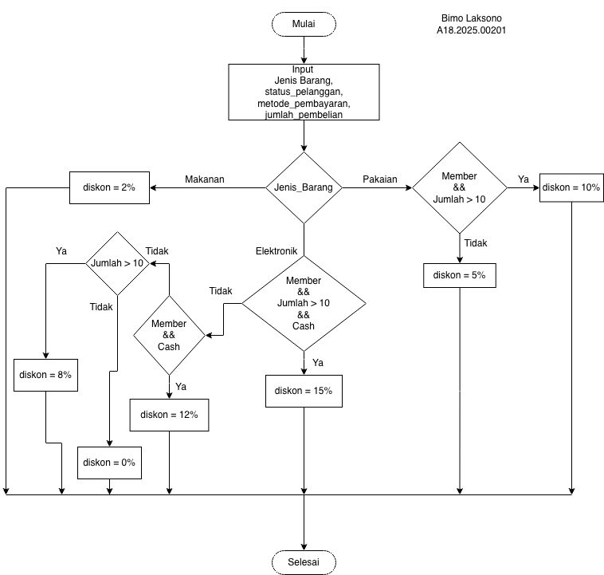

# Flowchart Diskon



# Notasi Algoritma

```
Mulai
    Input jenis_barang
    Input status_pelanggan   // Member atau Non Member
    Input metode_pembayaran  // Cash atau Kredit
    Input jumlah_pembelian   // jumlah barang

    IF jenis_barang = "Makanan":
        diskon = 2%

    IF jenis_barang = "Pakaian" Maka
        IF status_pelanggan = "Member" AND jumlah_pembelian > 10 Maka
            diskon = 10%
        Else
            diskon = 5%
        EndIf

    IF jenis_barang = "Elektronik" Maka
        IF status_pelanggan = "Member" AND jumlah_pembelian > 10 AND metode_pembayaran = "Cash" Maka
            diskon = 15%
        Else IF status_pelanggan = "Member" AND metode_pembayaran = "Cash" Maka
            diskon = 12%
        Else IF jumlah_pembelian > 10 Maka
            diskon = 8%
        Else
            diskon = 0%
        EndIf
    EndIf

    Output "Total Diskon = ", diskon
Selesai

```